<p align="center">
  <a href="https://upstash.com" aria-label="Upstash">
    
  </a>
</p>

<h1 align="center">Deadwire</h1>

<p align="center"><strong>Failure intelligence and recovery control for durable workflows.</strong></p>

<p align="center">
  
  
  
  
  
</p>

<p align="center">
  <a href="#why-deadwire">Why Deadwire</a> ·
  <a href="#quick-start">Quick start</a> ·
  <a href="#upstash-integration">Upstash integration</a> ·
  <a href="#recovery-protocol">Recovery protocol</a> ·
  <a href="#security">Security</a> ·
  <a href="#release-materials">Release materials</a>
</p>

> **Upstash keeps workflows durable. Deadwire determines whether recovering them is safe.**

Deadwire is an Upstash-first recovery-intelligence control plane. It sits above Upstash Workflow and QStash; it does not replace their execution model. Deadwire groups DLQ entries into operational incidents, assembles provenance and side-effect evidence, analyzes workflow-version compatibility, runs verifier-backed simulation, and gates recovery behind policy, approvals, flow control, canaries, and receipts.

The Upstash mark above is served from Upstash’s official domain and is used only to identify the supported integration. Deadwire is independent software and is not affiliated with, sponsored by, or endorsed by Upstash.

## Table of contents

- [Why Deadwire](#why-deadwire)
- [Product capabilities](#product-capabilities)
- [Architecture](#architecture)
- [Animated product walkthrough](#animated-product-walkthrough)
- [Quick start](#quick-start)
- [Upstash integration](#upstash-integration)
- [Evidence model](#evidence-model)
- [Incident intelligence](#incident-intelligence)
- [Recovery protocol](#recovery-protocol)
- [Simulation and side-effect verification](#simulation-and-side-effect-verification)
- [Workflow compatibility](#workflow-compatibility)
- [Agent forensics](#agent-forensics)
- [CLI and local dashboard](#cli-and-local-dashboard)
- [Production deployment](#production-deployment)
- [Security](#security)
- [GitHub Pages product demo](#github-pages-product-demo)
- [Static demo to product conversion](#static-demo-to-product-conversion)
- [Repository map](#repository-map)
- [Release materials](#release-materials)
- [Verification and benchmarks](#verification-and-benchmarks)
- [Status and limitations](#status-and-limitations)

## Why Deadwire

Retries solve transient faults. DLQs preserve failed work. Neither tells an operator whether retrying an execution after a deploy, an API contract change, or an uncertain payment side effect is actually correct.

Consider a checkout workflow with 8,147 failed executions. A deploy changes an external provider integration from `payments-api/v2` to `payments-api/v3`; the response schema now differs. The operator has a bulk-resume button, but not the answers that matter:

- Are the 8,147 failures one incident or several independent problems?
- Which deployment and dependency boundary are shared?
- Would resume fail again under current code?
- Did an earlier attempt charge the customer, send the email, invoke the webhook, or provision infrastructure?
- Did any completed workflow step change before the failed boundary?
- Can recovery start with a low-risk canary rather than a full-scale replay?

Deadwire turns that ambiguity into an explicit, auditable decision.

```yaml
incident: DW-193
affected_executions: 8147
common_failure_boundary: checkout.finalize → payments-api/v3
probable_change: payment provider response schema
recovery:
  safe_resume: 6921
  safe_restart: 811
  manual_review: 304
  external_side_effect_unknown: 111
```

The point is not a prettier DLQ. The point is recovery correctness.

## Product capabilities

| Capability | What Deadwire does | Why it matters for Upstash workflows |
| --- | --- | --- |
| Incident clustering | Converts normalized DLQ failures into deterministic incident groups and shared dependency boundaries | Thousands of retries become one operator-sized incident |
| Evidence graph | Captures workflow provenance, source hashes, completed steps, sanitized shapes, trace identifiers, and side-effect metadata | Recovery decisions have supporting facts rather than intuition |
| Replay-risk analysis | Separates `SAFE`, `UNSAFE`, and `UNKNOWN` retry evidence | Unknown effects cannot silently become duplicate payments or messages |
| Workflow compatibility | Detects candidate code changes before completed workflow boundaries | Protects persisted workflow state when code changes between failure and resume |
| Side-effect verification | Supports payment, delivery, outbox, object-output, and HTTP-contract verifier adapters | A replay can be proven or blocked per external boundary |
| Recovery policy | Enforces required roles, independent approvals, batch ceilings, and canary policy | Operational safety scales beyond a single person clicking resume |
| QStash recovery control | Builds exact resume previews with retries and flow-control headers | Uses Upstash control primitives rather than inventing a parallel runner |
| Recovery receipts | Records approved recovery intent and maps original DLQ IDs to resumed workflow runs | Provides a durable audit trail and reconciliation basis |
| Deployment intelligence | Correlates GitHub/Vercel/CI deployment signals with failed runs | Makes code-diff causality visible at the recovery boundary |
| Agent forensics | Detects low-progress loops and estimates wasted model calls | Extends recovery correctness to durable autonomous systems |
| Product demo | Includes a static GitHub Pages site and deterministic CLI walkthrough | Makes the product legible in a buyer, partner, or internal review |

## Architecture

```text
 ┌──────────────────────────────────────────────────────────────────┐
 │                       Customer application                         │
 │  Upstash Workflow · QStash · Workflow Agents · external services  │
 └─────────────┬───────────────────────────────────────┬────────────┘
               │                                       │
       Deadwire SDK bridge                      failure callback / DLQ
               │                                       │
               └───────────────┬───────────────────────┘
                               ▼
                    HMAC-signed evidence ingestion
                               │
                               ▼
        evidence graph → incident clustering → deployment / trace correlation
                               │
                               ▼
            compatibility gate + side-effect verifiers + simulation
                               │
                               ▼
  receipt → independent approval → 1% canary → observe → ramp → reconcile
                               │
                               ▼
           QStash resume with required flow-control configuration
```

### Design boundaries

Deadwire is deliberately constrained in several important ways:

1. **Upstash remains execution authority.** Workflow state, retries, DLQ retention, and resume are owned by Upstash.
2. **Deadwire is decision authority.** Evidence, compatibility assessment, policy checks, receipts, and recovery state are owned by Deadwire.
3. **Ambiguity fails closed.** If side effects, deployment provenance, or workflow compatibility cannot be established, automated recovery is withheld.
4. **No browser secrets.** Upstash tokens, verifier credentials, and HMAC secrets belong only in trusted server-side workers.
5. **No raw sensitive evidence by default.** Workflow evidence contains hashes and structural fingerprints, not payment IDs, customer records, raw payloads, or provider secrets.

## Animated product walkthrough

<p align="center">
  <a href="site/presentation.html">
    
  </a>
</p>

The animated walkthrough is a compact visual presentation built for technical demos, acquisition conversations, and GitHub Pages. It shows the four product moments that distinguish Deadwire from a DLQ interface:

1. individual failed runs accumulate without an operational answer;
2. Deadwire clusters them into one shared deployment/dependency incident;
3. side-effect evidence blocks an unsafe payment replay; and
4. a verified fix proceeds through receipt, canary, observation, controlled ramp, and reconciliation.

Open [the full-screen presentation](site/presentation.html) to replay it, or press **R** inside the presentation to restart the animation. It uses fixture data only and does not depict a live customer incident.

## Quick start

### Requirements

- Node.js 20 or later
- npm
- No Upstash account is required for fixture-mode evaluation

### Install and verify

```powershell
npm install
npm run typecheck
npm test
```

The suite exercises incident clustering, retry safety, simulation gates, evidence signing, canary halting, deployment compatibility, trace correlation, agent loops, side-effect verification, Upstash DLQ normalization, and configuration diagnostics.

### Start the local dashboard

```powershell
npm run dev
```

Open `http://127.0.0.1:8787`. The dashboard is explicitly fixture-seeded. It does not present fixture data as a connected Upstash account.

### Run the buyer demo

```powershell
npm run demo
```

The command prints a compact incident summary, blast radius, recovery classifications, policy guardrails, and a deterministic decision ID.

## Upstash integration

Deadwire integrates through documented, owned application boundaries. It does not monkey-patch Upstash SDK internals or impersonate an Upstash control plane.

### 1. Instrument owned workflow boundaries

Use `UpstashEvidenceBridge` next to callbacks you own. The bridge records source hash, ordering, completion state, declared side-effect type, idempotency-key hash, provider-transaction hash, and sanitized request/response shape hashes.

```ts
import { HmacEvidenceEmitter, UpstashEvidenceBridge } from "deadwire";

const bridge = new UpstashEvidenceBridge(
  "tenant_acme",
  context.workflowRunId,
  {
    workflow: "checkout",
    workflowVersion: "v18",
    deploymentSha: process.env.GIT_SHA!,
    environment: "production",
  },
  new HmacEvidenceEmitter(
    process.env.DEADWIRE_EVIDENCE_URL!,
    process.env.DEADWIRE_INGEST_SECRET!,
  ),
);

await bridge.run(
  "charge-customer",
  chargeCustomer,
  () => context.run("charge-customer", chargeCustomer),
  {
    sideEffect: "payment",
    idempotencyKey,
    providerTransactionId,
    request: { customerId, amount },
  },
);

await bridge.flush();
```

The bridge intentionally keeps `context.run` in your control. It records evidence around your callback; it does not alter retry semantics or make a payment safe merely because it was observed.

See the [complete illustrative route](examples/upstash-workflow/route.ts).

### 2. Import and enrich DLQ evidence

`UpstashWorkflowAdapter` supports paginated DLQ reads, individual DLQ-message reads, normalized failures, and resume previews. A trusted worker supplies an account-scoped QStash token only at runtime.

```ts
const adapter = new UpstashWorkflowAdapter({
  token: process.env.UPSTASH_QSTASH_TOKEN!,
});

const page = await adapter.listDlq();
const normalized = page.messages.map(normalizeUpstashDlq);
```

Normalization is deliberately conservative. Missing fields become unknown evidence, which pushes recovery toward manual review rather than an optimistic automatic classification.

### 3. Diagnose production configuration

```powershell
npm run cli -- doctor
```

The diagnostic checks for a trusted QStash token, HMAC evidence secret, deployment SHA provenance, and production persistence. A missing evidence HMAC secret is a hard failure; missing optional integrations are warnings.

### 4. Prepare—not blindly execute—recovery

```ts
const preview = adapter.previewResume(dlqIds, {
  key: "incident-DW-193",
  parallelism: 5,
  rate: 1,
  period: "1s",
  retries: 3,
});
```

The preview is not a mutation. An approved `RecoveryReceipt`, a recovery batch in the correct state, and a trusted control worker are required before the real QStash resume client can act.

For product-level integration detail, see [Upstash integration blueprint](docs/UPSTASH_INTEGRATION_BLUEPRINT.md).

## Evidence model

`WorkflowEvidence` is the minimum trustworthy unit Deadwire needs to reason about recovery:

```ts
interface WorkflowEvidence {
  tenantId: string;
  runId: string;
  provenance: {
    workflow: string;
    workflowVersion: string;
    deploymentSha: string;
    environment: string;
    sourceCommit?: string;
    traceId?: string;
    spanId?: string;
  };
  steps: Array<{
    step: string;
    stepHash: string;
    ordinal: number;
    completed: boolean;
    sideEffect: "payment" | "email" | "webhook" | "database-write" | "provisioning" | "object-write" | "none";
    idempotencyKeyHash?: string;
    providerTransactionIdHash?: string;
    requestShapeHash?: string;
    responseShapeHash?: string;
  }>;
  emittedAt: string;
}
```

### Evidence handling rules

- Hash idempotency keys and provider transaction references before sending them to Deadwire.
- Emit payload *shape* fingerprints instead of raw request/response bodies where possible.
- Sanitize captured replay fixtures before any simulation.
- Scope evidence to a tenant and enforce tenant isolation in production persistence.
- Treat the evidence webhook as an internet-facing security boundary.

## Incident intelligence

Deadwire fingerprints failures using the failed step, deployment, dependency, status, normalized exception, request/response shape, and environment. It clusters equivalent failures into one incident while retaining per-execution evidence.

### Blast radius

For each incident, Deadwire derives:

- affected workflow names
- affected execution count
- shared dependencies
- implicated deployments
- affected environments
- incident severity
- time-ordered failure, deployment, trace, decision, and recovery events

### Deployment and trace correlation

`GitHubDeploymentSource` can compare deployment SHAs through a fine-grained, read-only GitHub token. Vercel deployment webhooks can be normalized after verification at the hosting edge. OpenTelemetry-style trace signals aggregate failing dependency boundaries across different workflows.

Deadwire does not claim causality merely because a deployment preceded an error. It records the correlation and uses completed-step source changes as a conservative compatibility gate.

### Runbooks and ownership

Runbooks match workflow, dependency, and failure text conditions. Operational incidents carry state (`DETECTED`, `TRIAGED`, `MITIGATING`, `RECOVERING`, `RESOLVED`, `POSTMORTEM`), severity, ownership, timeline, and tags. This creates a clean path to Slack, PagerDuty, Linear, and internal-console integrations without putting those vendor credentials in the core library.

## Recovery protocol

Recovery is a stateful protocol, not a bulk action button.

```text
propose → simulate → approve → canary → observe → ramp → reconcile → receipt
```

| Stage | Required condition | Output |
| --- | --- | --- |
| Propose | No blocked/manual executions in the selected subset | Signed plan hash and receipt draft |
| Simulate | Relevant side effects have verifier evidence | Pass/fail/unknown evidence per execution |
| Approve | Required number and roles of approvers | Approved recovery receipt |
| Canary | Mandatory nonzero flow control | Small recovery batch, default 1% |
| Observe | No recurrence or unacceptable error rate | Continue or halt decision |
| Ramp | Clean canary plus policy compliance | Controlled batch progression |
| Reconcile | Provider results received | Original DLQ ID → new workflow run ID mapping |
| Receipt | Immutable history assembled | Auditable recovery artifact |

### Policy guardrails

`RecoveryGuardrail` controls:

- maximum batch size
- canary percentage
- maximum tolerated error rate
- required number of approvals
- required approval roles

Deadwire refuses recovery if any selected execution is `BLOCK` or `MANUAL_REVIEW`, the batch exceeds policy, or approval requirements are unmet. That is intentional: the product’s central value is knowing when not to resume.

## Simulation and side-effect verification

Deadwire simulations are deterministic evidence evaluations, not generic “dry runs.” A simulation can only pass when the relevant boundary has a verifier capable of establishing an outcome.

| Boundary | Verifier adapter | Example evidence |
| --- | --- | --- |
| Payment | `PaymentTransactionVerifier` | payment provider ledger indicates transaction absent or confirmed |
| Email / webhook | `EmailOrWebhookVerifier` | delivery ledger identifies idempotent delivery outcome |
| Database write | `DatabaseOutboxVerifier` | transactional outbox confirms committed or absent event |
| Object output | `ObjectOutputVerifier` | expected output hash is present or absent |
| HTTP dependency | `HttpSideEffectVerifier` | sandbox/contract endpoint returns a validated outcome |

If a verifier is missing, unreachable, malformed, or inconclusive, its outcome is `UNKNOWN`. Unknown is not treated as safe.

## Workflow compatibility

Resuming a failed workflow against new code is safe only when the code that produced already-persisted state is compatible with the candidate deployment.

Deadwire compares completed step hashes with candidate step hashes, then combines that result with deployment file/package signals. A changed completed boundary produces `MANUAL_REVIEW` even when the failed step itself appears idempotent.

This formalizes a critical durable-workflow rule: changing code before a failed checkpoint can invalidate the state needed to resume safely.

## Agent forensics

Durable agents add a second class of failure: the run may technically be recoverable while still wasting budget or repeating non-progressing work.

Deadwire includes:

- repeated-state cycle detection
- semantic-progress scoring input
- estimated unnecessary model-call count
- model input/output token and USD cost attribution contracts
- agent-tool boundary instrumentation through `UpstashEvidenceBridge.tool`

The recommended product direction is an agent incident view that shows planner → subagent → tool boundaries, identifies loops and tool-schema drift, and marks safe checkpoints for controlled continuation.

## CLI and local dashboard

| Command | Purpose |
| --- | --- |
| `npm run cli -- inspect <dlq-id>` | Print the clustered incident for a DLQ entry |
| `npm run cli -- plan <incident-id>` | Print execution-level recovery recommendations |
| `npm run cli -- simulate <incident-id>` | Run deterministic fixture simulation |
| `npm run cli -- receipt <incident-id> <operator>` | Attempt to create an approval-gated receipt |
| `npm run cli -- loops` | Display a fixture agent loop report |
| `npm run cli -- doctor` | Report unsafe/missing production configuration |
| `npm run demo` | Print a compact buyer-ready incident walkthrough |

The local dashboard runs on `127.0.0.1:8787` and persists development evidence in `.deadwire/evidence.json`. The path is excluded from Git and is not a multi-tenant production datastore.

## Production deployment

### Required components

1. A trusted server-side evidence ingress with TLS, HMAC verification, replay protection, rate limiting, and tenant routing.
2. A tenant-aware Postgres implementation of `TenantEvidenceRepository` using [db/schema.sql](db/schema.sql).
3. An identity provider integrated with Deadwire roles (`viewer`, `responder`, `approver`, `admin`).
4. An encrypted raw-evidence vault if retention of redacted payload fixtures is required.
5. A trusted recovery worker holding the QStash token and external verifier credentials.
6. Deployment and trace connectors that run server-side with least-privilege tokens.

### Suggested deployment topology

```text
Internet → WAF / API gateway → Deadwire evidence ingress → Postgres + encrypted vault
                                             │
                                     queue / durable worker
                                             │
                    Upstash QStash control + provider verifier adapters
```

### Persistence

The included `PostgresEvidenceRepository` is intentionally dependency-injected through `SqlExecutor`; it does not hide database credentials in the SDK. The schema includes tenant-scoped evidence and append-only audit events. Production deployments should add migrations, row-level controls where appropriate, retention jobs, backups, and observability.

## Security

Security is foundational because Deadwire handles failure evidence and proposes actions around externally visible side effects.

- Evidence webhooks require `HMAC-SHA256` over the exact request body.
- Deadwire uses timing-safe signature comparison.
- Provider tokens are server-side environment values; never put them in client JavaScript, static Pages assets, or fixture data.
- Idempotency and transaction identifiers are hashed before evidence emission.
- Unknown external effects block automatic recovery.
- Recovery receipts are tenant-scoped, policy-gated, and approval-required.
- Upstash resume requests carry explicit flow-control configuration.
- Local JSON persistence is development-only; production requires authenticated, encrypted, tenant-isolated storage.

Read the full [security model](SECURITY.md) and [architecture notes](ARCHITECTURE.md).

## GitHub Pages product demo

The static product site lives in [`site/`](site/). It is intentionally self-contained, requires no API token, and contains no customer evidence. Open [`site/index.html`](site/index.html) locally or deploy it with GitHub Pages.

The included [GitHub Actions workflow](.github/workflows/deploy-pages.yml) publishes the `site/` directory on pushes to `main`. Before enabling it:

1. Push the repository to GitHub.
2. Go to **Settings → Pages**.
3. Select **GitHub Actions** as the source.
4. Confirm repository Actions can deploy Pages.
5. Push `main` or dispatch the workflow manually.

Full setup instructions are in [docs/GITHUB_PAGES.md](docs/GITHUB_PAGES.md).

## Verification and benchmarks

Deadwire includes deterministic type, behavior, demo, static-asset, and core-performance checks. The frozen `1.9.1` release run passed **21 automated tests** and processed a synthetic, sanitized **10,000-run** incident corpus at approximately **215,875 clustering runs/second** on the local Windows/Node workspace. The core analysis path—planning, simulation classification, cause hypothesis, blast-radius derivation, and policy decision—completed in **3.87 ms** for that corpus.

These are transparent implementation-level results, not a claim about hosted throughput, QStash API latency, database performance, encrypted vault latency, or external verifier capacity. Reproduce them with:

```powershell
npm run typecheck
npm test
npm run demo
npm run benchmark
```

Read [VERIFICATION.md](VERIFICATION.md) for coverage and [BENCHMARKS.md](BENCHMARKS.md) for method, result, and scope.

## Static demo to product conversion

The static GitHub Pages site is designed to serve immediately as an acquisition or partner presentation and to convert cleanly into a full product surface afterward.

- The existing animated walkthrough becomes a reusable onboarding/recovery explainer component.
- The incident-demo treatment maps directly to the incident queue and detail routes described in `apps/console/`.
- The static scenario controls map to live API calls for plans, simulations, receipts, and recovery batches.
- The styling establishes the product’s dark technical visual language without copying Upstash branding or console layouts.
- The presentation makes no network calls, so it remains safe for public GitHub Pages; the future console reads only tenant-authenticated API data.

See [the frontend/backend conversion guide](docs/FRONTEND_BACKEND_CONVERSION.md) and [the acquisition handoff guide](docs/ACQUISITION_HANDOFF.md).

## Repository map

```text
Deadwire/
├── src/
│   ├── core.ts                 # incidents, fingerprints, retry safety, compatibility
│   ├── sdk.ts                  # evidence recorder and HMAC emitter
│   ├── upstash-native.ts       # DLQ adapter, bridge, recovery preview, diagnostics
│   ├── upstash-control.ts      # approved receipt + canary/ramp/reconcile control
│   ├── operations.ts           # severity, blast radius, runbooks, policy decisions
│   ├── simulation.ts           # verifier registry
│   ├── provider-verifiers.ts   # payment/delivery/outbox/object adapters
│   ├── intelligence.ts         # deployment, trace, and agent-cost correlation
│   └── production.ts           # tenancy, RBAC, audit, Postgres repository contract
├── db/schema.sql               # production persistence starting schema
├── examples/upstash-workflow/  # illustrative SDK integration
├── apps/                       # console, ingress, and recovery-worker contracts
├── packages/                   # SDK, adapter, evidence, policy, simulation, agent surfaces
├── connectors/                 # GitHub, Vercel, OpenTelemetry, and Sentry contracts
├── schemas/                    # JSON interchange schemas
├── policies/                   # versioned recovery policies
├── runbooks/                   # repeatable operator procedures
├── fixtures/                   # sanitized incident and replay fixtures
├── deploy/                     # production topology and environment guidance
├── scripts/                    # release and demo validation helpers
├── site/                       # static product demo for GitHub Pages
├── docs/                       # acquisition, demo, integration, and Pages materials
├── RELEASE_NOTES.md
├── CHANGELOG.md
└── LICENSE                     # proprietary evaluation license
```

## Release materials

- [Release notes](RELEASE_NOTES.md)
- [Changelog](CHANGELOG.md)
- [Acquisition brief](docs/ACQUISITION_BRIEF.md)
- [Live-demo script](docs/DEMO_SCRIPT.md)
- [Integration guide](docs/INTEGRATIONS.md)
- [Upstash product integration blueprint](docs/UPSTASH_INTEGRATION_BLUEPRINT.md)
- [GitHub Pages guide](docs/GITHUB_PAGES.md)
- [Static demo → product conversion](docs/FRONTEND_BACKEND_CONVERSION.md)
- [Acquisition handoff](docs/ACQUISITION_HANDOFF.md)
- [Acquisition and restricted-use notice](ACQUISITION.md)
- [Workspace map](WORKSPACE.md)
- [Proprietary license](LICENSE)
- [1.9.1 source release archive](artifacts/Deadwire-1.9.1.zip)
- [Verification report](VERIFICATION.md)
- [Benchmark report](BENCHMARKS.md)
- [Release freeze checklist](FREEZE.md)

## Status and limitations

Deadwire `1.9.1` is a comprehensive, tested product and integration foundation. It is not a hosted production service and does not claim to have been deployed against a live Upstash account.

To use it with a real customer workload, an operator must configure production identity, Postgres, HMAC secrets, QStash credentials, deployment/trace connectors, and verifier adapters. No recovery action occurs automatically, and no external Upstash resume was triggered while preparing this repository.

This conservative posture is deliberate: a recovery-control product only earns trust when it is precise about both its evidence and its limits.
